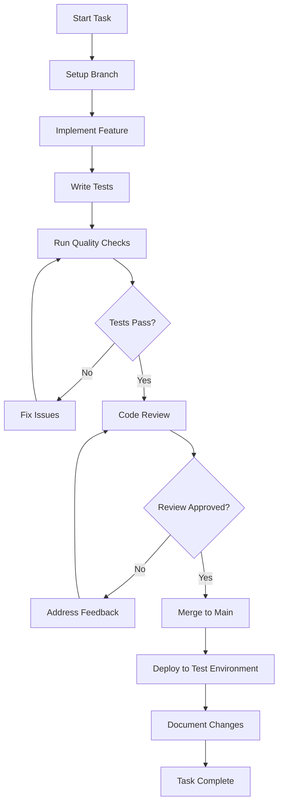

# Helpy Ninja - Development Roadmap & Task List

## Overview
This document provides a comprehensive task breakdown, coding procedures, and quality gates for the Helpy Ninja Flutter application development. Each phase includes specific deliverables, testing requirements, and pause points for validation.

## Coding Procedures & Quality Gates

### Development Workflow


### Quality Gates
**Before proceeding to next task, ensure:**
1. ✅ All unit tests pass (minimum 80% coverage)
2. ✅ Widget tests pass for new UI components
3. ✅ `flutter analyze` reports no issues
4. ✅ `flutter test` completes successfully
5. ✅ Manual testing on 2+ devices/simulators
6. ✅ Documentation updated
7. ✅ Git commit with descriptive message

### Pause & Test Points
- **End of each Phase**: Full integration testing
- **End of each Week**: Demo to stakeholders
- **After UI changes**: Accessibility audit
- **Before merging**: Performance profiling

---

## Phase 1: Foundation & Setup (Weeks 1-2)

### Week 1: Project Infrastructure
**Goal**: Establish solid project foundation with modern architecture

#### Task 1.1: Project Initialization & Dependencies
**Duration**: 1 day
**Assignee**: Lead Developer

**Subtasks**:
- [ ] Create Flutter project with proper structure
- [ ] Add all required dependencies to pubspec.yaml
- [ ] Setup development environment configs
- [ ] Configure build variants (dev, staging, prod)
- [ ] Setup Git repository with proper .gitignore

**Dependencies Added**:
```yaml
dependencies:
  flutter_riverpod: ^2.4.0
  riverpod_annotation: ^2.3.0
  go_router: ^12.0.0
  dio: ^5.3.2
  hive: ^2.2.3
  flutter_localizations:
    sdk: flutter
  intl: ^0.18.1
  google_fonts: ^6.1.0
  # ... (full list in spec)

dev_dependencies:
  riverpod_generator: ^2.3.0
  build_runner: ^2.4.7
  intl_utils: ^2.8.5
  flutter_lints: ^3.0.0
```

**Deliverables**:
- ✅ Working Flutter project
- ✅ All dependencies resolved
- ✅ Build variants configured
- ✅ Development environment ready

**Testing**: 
- `flutter doctor` shows no issues
- `flutter build apk --debug` succeeds
- Project structure matches specification

---

#### Task 1.2: Localization Setup
**Duration**: 1 day
**Assignee**: Frontend Developer

**Subtasks**:
- [ ] Configure l10n.yaml
- [ ] Create English ARB file with all strings
- [ ] Create Vietnamese ARB file with translations
- [ ] Setup AppLocalizations provider
- [ ] Test locale switching functionality

**Deliverables**:
- ✅ Complete English translations (app_en.arb)
- ✅ Complete Vietnamese translations (app_vi.arb)
- ✅ Working locale switching
- ✅ Fallback to English if translation missing

**Testing**:
- Switch device language and verify app responds
- Test missing translation fallback
- Verify Vietnamese diacritics display correctly

---

#### Task 1.3: Theme System & Design Tokens
**Duration**: 2 days
**Assignee**: UI/UX Developer

**Subtasks**:
- [ ] Create DesignTokens class with color palette
- [ ] Implement dark theme (primary)
- [ ] Implement light theme (secondary)
- [ ] Setup dynamic theme switching
- [ ] Create custom component themes
- [ ] Add Google Fonts integration

**Deliverables**:
- ✅ Complete theme system
- ✅ Dark/light mode switching
- ✅ Consistent design tokens
- ✅ Custom component styling

**Testing**:
- Test theme switching on different devices
- Verify color contrast ratios (WCAG AA)
- Test with system theme changes

---

#### Task 1.4: Navigation & Routing
**Duration**: 1 day
**Assignee**: Frontend Developer

**Subtasks**:
- [ ] Setup Go Router configuration
- [ ] Create route definitions
- [ ] Implement authentication guards
- [ ] Add nested routing for tabs
- [ ] Create route transition animations

**Deliverables**:
- ✅ Complete routing structure
- ✅ Authentication flow routing
- ✅ Tab navigation
- ✅ Smooth transitions

**Testing**:
- Test deep linking
- Verify authentication redirects
- Test back button behavior

---

### Week 2: Core Architecture & Authentication

#### Task 2.1: State Management Foundation
**Duration**: 2 days
**Assignee**: Senior Developer

**Subtasks**:
- [ ] Setup Riverpod providers structure
- [ ] Create base state classes with Freezed
- [ ] Implement AppNotifier for global state
- [ ] Setup LocaleNotifier for language switching
- [ ] Create error handling patterns

**Deliverables**:
- ✅ Riverpod provider architecture
- ✅ Type-safe state management
- ✅ Global app state handling
- ✅ Locale management

**Testing**:
- Unit tests for all notifiers
- Test state persistence
- Verify error handling

---

#### Task 2.2: User Authentication System
**Duration**: 2 days
**Assignee**: Backend Integration Developer

**Subtasks**:
- [ ] Create User entity and models
- [ ] Implement AuthNotifier with Riverpod
- [ ] Build login/register screens
- [ ] Add form validation
- [ ] Implement secure token storage
- [ ] Setup mock authentication for development

**Deliverables**:
- ✅ Complete authentication flow
- ✅ Secure credential storage
- ✅ Form validation
- ✅ Mock API integration

**Testing**:
- Unit tests for auth logic
- Widget tests for auth screens
- Test invalid credential handling
- Verify token persistence

---

#### Task 2.3: Onboarding Flow
**Duration**: 2 days
**Assignee**: UI/UX Developer

**Subtasks**:
- [ ] Create welcome screen with animations
- [ ] Build profile setup screens
- [ ] Implement Helpy customization
- [ ] Add subject selection interface
- [ ] Create progress indicators

**Deliverables**:
- ✅ Animated welcome experience
- ✅ Profile setup flow
- ✅ Helpy personalization
- ✅ Subject selection

**Testing**:
- Test onboarding completion
- Verify animations on different devices
- Test form validation
- Check progress persistence

---

### Phase 1 Quality Gate
**Before proceeding to Phase 2:**
- [ ] All Phase 1 tasks completed
- [ ] Authentication flow working end-to-end
- [ ] Localization functional in both languages
- [ ] Theme switching working properly
- [ ] No critical bugs in issue tracker
- [ ] Code coverage > 80% for core modules
- [ ] Performance baseline established

---

## Phase 2: Basic Chat System (Weeks 3-4)

### Week 3: Chat UI Foundation

#### Task 3.1: Chat Models & Entities
**Duration**: 1 day
**Assignee**: Backend Integration Developer

**Subtasks**:
- [ ] Create Message entity with all content types
- [ ] Create Conversation entity
- [ ] Implement Helpy entity with personality
- [ ] Setup message serialization
- [ ] Create mock data generators

**Deliverables**:
- ✅ Complete domain models
- ✅ JSON serialization
- ✅ Mock data for testing
- ✅ Type-safe entities

**Testing**:
- Unit tests for all models
- Test serialization/deserialization
- Verify mock data generation

---

#### Task 3.2: Modern Chat Interface
**Duration**: 3 days
**Assignee**: UI/UX Developer

**Subtasks**:
- [ ] Create ModernMessageBubble with glassmorphism
- [ ] Implement chat input with modern styling
- [ ] Add typing indicators and animations
- [ ] Create Helpy thinking indicator
- [ ] Setup message list with proper scrolling
- [ ] Add swipe-to-action functionality

**Deliverables**:
- ✅ Beautiful chat interface
- ✅ Smooth animations
- ✅ Gesture interactions
- ✅ Accessibility support

**Testing**:
- Widget tests for all components
- Test on different screen sizes
- Verify accessibility features
- Test gesture interactions

---

#### Task 3.3: Markdown & Math Rendering
**Duration**: 1 day
**Assignee**: Frontend Developer

**Subtasks**:
- [ ] Integrate flutter_markdown
- [ ] Setup flutter_math_fork for LaTeX
- [ ] Create custom markdown styles
- [ ] Add code syntax highlighting
- [ ] Test complex mathematical expressions

**Deliverables**:
- ✅ Markdown message rendering
- ✅ LaTeX math support
- ✅ Code highlighting
- ✅ Custom styling

**Testing**:
- Test various markdown formats
- Verify math equation rendering
- Test code block styling

---

### Week 4: Chat Functionality

#### Task 4.1: Chat State Management
**Duration**: 2 days
**Assignee**: Senior Developer

**Subtasks**:
- [ ] Implement ChatNotifier with Riverpod
- [ ] Create ConversationMessages family provider
- [ ] Add optimistic message updates
- [ ] Implement error handling and retry logic
- [ ] Setup message status tracking

**Deliverables**:
- ✅ Reactive chat state
- ✅ Optimistic updates
- ✅ Error recovery
- ✅ Message status tracking

**Testing**:
- Unit tests for chat logic
- Test optimistic updates
- Verify error handling
- Test state persistence

---

#### Task 4.2: Mock LLM Integration
**Duration**: 2 days
**Assignee**: AI Integration Developer

**Subtasks**:
- [ ] Create MockLLMService
- [ ] Implement HelpyResponseNotifier
- [ ] Add response generation with delays
- [ ] Create personality-based responses
- [ ] Setup conversation context handling

**Deliverables**:
- ✅ Mock AI responses
- ✅ Personality variations
- ✅ Context awareness
- ✅ Realistic delays

**Testing**:
- Test response generation
- Verify personality differences
- Test context handling
- Check response timing

---

#### Task 4.3: Local Storage & Offline Queuing
**Duration**: 1 day
**Assignee**: Backend Integration Developer

**Subtasks**:
- [ ] Setup Hive boxes for messages
- [ ] Implement message caching
- [ ] Create offline message queue
- [ ] Add sync mechanism for when online
- [ ] Setup conversation persistence

**Deliverables**:
- ✅ Local message storage
- ✅ Offline message queue
- ✅ Sync functionality
- ✅ Conversation persistence

**Testing**:
- Test offline message creation
- Verify sync when back online
- Test data persistence
- Check storage efficiency

---

### Phase 2 Quality Gate
**Before proceeding to Phase 3:**
- [ ] 1-on-1 chat fully functional
- [ ] Messages persist locally
- [ ] Mock AI responses working
- [ ] Offline queuing operational
- [ ] UI animations smooth (60fps)
- [ ] Memory usage within limits
- [ ] All tests passing

---

## Phase 3: Multi-Agent System (Weeks 5-6)

### Week 5: Group Chat Infrastructure

#### Task 5.1: WebSocket Service
**Duration**: 2 days
**Assignee**: Network Developer

**Subtasks**:
- [ ] Create WebSocketService with reconnection
- [ ] Implement message broadcasting
- [ ] Add connection state management
- [ ] Create heartbeat mechanism
- [ ] Setup error handling and fallbacks

**Deliverables**:
- ✅ Robust WebSocket connection
- ✅ Auto-reconnection
- ✅ Connection monitoring
- ✅ Error recovery

**Testing**:
- Test connection stability
- Verify reconnection logic
- Test network interruption handling
- Load test with multiple messages

---

#### Task 5.2: Group Session Management
**Duration**: 2 days
**Assignee**: Senior Developer

**Subtasks**:
- [ ] Create GroupSession entity
- [ ] Implement GroupSessionNotifier
- [ ] Add participant tracking
- [ ] Create session join/leave logic
- [ ] Setup session state synchronization

**Deliverables**:
- ✅ Group session management
- ✅ Participant tracking
- ✅ State synchronization
- ✅ Join/leave functionality

**Testing**:
- Test session creation
- Verify participant management
- Test state synchronization
- Check edge cases

---

#### Task 5.3: Multi-Agent Coordination
**Duration**: 1 day
**Assignee**: AI Integration Developer

**Subtasks**:
- [ ] Create MultiAgentCoordinator
- [ ] Implement turn-taking algorithm
- [ ] Add response permission system
- [ ] Create conflict resolution logic
- [ ] Setup attention management

**Deliverables**:
- ✅ AI coordination system
- ✅ Turn-taking logic
- ✅ Conflict resolution
- ✅ Attention management

**Testing**:
- Test multiple AI interactions
- Verify turn-taking works
- Test conflict scenarios
- Check response timing

---

### Week 6: Group Chat UI & Experience

#### Task 6.1: Group Chat Interface
**Duration**: 2 days
**Assignee**: UI/UX Developer

**Subtasks**:
- [ ] Create group chat screen layout
- [ ] Add multiple Helpy indicators
- [ ] Implement participant list
- [ ] Create session status indicators
- [ ] Add visual cues for AI coordination

**Deliverables**:
- ✅ Group chat interface
- ✅ Multi-Helpy visualization
- ✅ Participant management UI
- ✅ Status indicators

**Testing**:
- Widget tests for group components
- Test with multiple participants
- Verify visual indicators
- Test responsive layout

---

#### Task 6.2: Real-time Synchronization
**Duration**: 2 days
**Assignee**: Network Developer

**Subtasks**:
- [ ] Implement real-time message sync
- [ ] Add typing indicators for group
- [ ] Create presence indicators
- [ ] Setup message ordering
- [ ] Add conflict resolution for simultaneous messages

**Deliverables**:
- ✅ Real-time synchronization
- ✅ Group typing indicators
- ✅ Presence management
- ✅ Message ordering

**Testing**:
- Test real-time sync
- Verify message ordering
- Test simultaneous messages
- Check presence accuracy

---

#### Task 6.3: Group Dynamics Features
**Duration**: 1 day
**Assignee**: UI/UX Developer

**Subtasks**:
- [ ] Add participation balancing UI
- [ ] Create engagement metrics display
- [ ] Implement quiet student prompts
- [ ] Add collaborative problem-solving aids
- [ ] Create session summary features

**Deliverables**:
- ✅ Participation monitoring
- ✅ Engagement features
- ✅ Student prompting
- ✅ Collaboration tools

**Testing**:
- Test participation tracking
- Verify engagement metrics
- Test prompting system
- Check collaboration features

---

### Phase 3 Quality Gate
**Before proceeding to Phase 4:**
- [ ] Group chat fully functional
- [ ] Multiple AIs coordinate properly
- [ ] Real-time sync working
- [ ] No message loss or duplication
- [ ] Performance acceptable with 8 participants
- [ ] WebSocket stability verified
- [ ] UI responsive under load

---

## Phase 4: Offline Capabilities & Learning Features (Weeks 7-8)

### Week 7: Offline-First Architecture

#### Task 7.1: Local LLM Integration
**Duration**: 3 days
**Assignee**: AI Integration Developer

**Subtasks**:
- [ ] Integrate TensorFlow Lite
- [ ] Setup Phi-3 Mini model loading
- [ ] Create LocalLLMService
- [ ] Implement model management (download/cache)
- [ ] Add model performance optimization

**Deliverables**:
- ✅ Local LLM functionality
- ✅ Model management system
- ✅ Performance optimization
- ✅ Fallback mechanisms

**Testing**:
- Test model loading
- Verify inference speed
- Test memory usage
- Check accuracy vs cloud models

---

#### Task 7.2: Intelligent LLM Routing
**Duration**: 2 days
**Assignee**: AI Integration Developer

**Subtasks**:
- [ ] Create LLMRouter with complexity assessment
- [ ] Implement intelligent routing logic
- [ ] Add bandwidth awareness
- [ ] Create fallback chains
- [ ] Setup performance monitoring

**Deliverables**:
- ✅ Smart LLM routing
- ✅ Complexity assessment
- ✅ Bandwidth optimization
- ✅ Fallback handling

**Testing**:
- Test routing decisions
- Verify fallback chains
- Test bandwidth adaptation
- Check performance metrics

---

### Week 8: Learning Dashboard & Features

#### Task 8.1: Subject Management System
**Duration**: 2 days
**Assignee**: Frontend Developer

**Subtasks**:
- [ ] Create Subject entity and models
- [ ] Implement subject selection interface
- [ ] Add progress tracking system
- [ ] Create curriculum alignment features
- [ ] Setup learning goals management

**Deliverables**:
- ✅ Subject management
- ✅ Progress tracking
- ✅ Goal setting
- ✅ Curriculum support

**Testing**:
- Test subject creation
- Verify progress calculation
- Test goal tracking
- Check curriculum alignment

---

#### Task 8.2: Modern Dashboard
**Duration**: 2 days
**Assignee**: UI/UX Developer

**Subtasks**:
- [ ] Create ModernDashboardCard components
- [ ] Implement progress visualization
- [ ] Add study streak tracking
- [ ] Create achievement system
- [ ] Build analytics displays

**Deliverables**:
- ✅ Beautiful dashboard
- ✅ Progress visualization
- ✅ Streak tracking
- ✅ Achievement system

**Testing**:
- Widget tests for dashboard
- Test data visualization
- Verify streak calculations
- Test responsive layout

---

#### Task 8.3: Interactive Learning Tools
**Duration**: 1 day
**Assignee**: Frontend Developer

**Subtasks**:
- [ ] Add basic whiteboard functionality
- [ ] Create simple assessment interface
- [ ] Implement practice mode
- [ ] Add voice input for questions
- [ ] Create learning session management

**Deliverables**:
- ✅ Interactive tools
- ✅ Assessment interface
- ✅ Practice mode
- ✅ Voice integration

**Testing**:
- Test whiteboard functionality
- Verify assessment logic
- Test voice input
- Check session management

---

### Phase 4 Quality Gate
**Before final deployment:**
- [ ] Offline functionality working
- [ ] Local LLM responses acceptable
- [ ] Dashboard displays correctly
- [ ] Learning tools functional
- [ ] Performance meets targets
- [ ] Battery usage optimized
- [ ] All accessibility features working

---

## Continuous Quality Assurance

### Daily Tasks
- [ ] Run `flutter analyze` - no warnings
- [ ] Execute `flutter test` - all tests pass
- [ ] Check code coverage - maintain >80%
- [ ] Review Git commits for quality
- [ ] Update documentation as needed

### Weekly Reviews
- [ ] Performance profiling
- [ ] Memory leak detection
- [ ] UI/UX review session
- [ ] Accessibility audit
- [ ] Security review
- [ ] Stakeholder demo

### Testing Strategy by Phase

#### Phase 1: Foundation Testing
- Unit tests for models and providers
- Widget tests for basic components
- Integration tests for authentication
- Accessibility tests for all screens

#### Phase 2: Chat Testing
- Unit tests for chat logic
- Widget tests for chat components
- Integration tests for message flow
- Performance tests for scrolling

#### Phase 3: Multi-Agent Testing
- Unit tests for coordination logic
- Integration tests for group sessions
- Load tests with multiple participants
- Network resilience testing

#### Phase 4: Offline Testing
- Unit tests for local LLM
- Integration tests for offline mode
- Performance tests for local inference
- Battery usage testing

### Documentation Requirements

#### Per Task Documentation
- [ ] Code comments for complex logic
- [ ] README updates for new features
- [ ] API documentation for services
- [ ] Widget documentation for reusable components

#### Per Phase Documentation
- [ ] Architecture decision records
- [ ] Performance benchmarks
- [ ] User testing results
- [ ] Deployment guides

### Definition of Done

#### Task Level
- [ ] Feature implemented and tested
- [ ] Code reviewed and approved
- [ ] Documentation updated
- [ ] No critical bugs
- [ ] Performance acceptable

#### Phase Level
- [ ] All tasks completed
- [ ] Integration testing passed
- [ ] Stakeholder approval received
- [ ] Performance benchmarks met
- [ ] Ready for next phase

---

## Emergency Procedures

### Critical Bug Response
1. **Immediate**: Stop development, assess impact
2. **1 hour**: Hotfix branch created
3. **4 hours**: Fix implemented and tested
4. **8 hours**: Fix deployed to test environment
5. **24 hours**: Fix validated and deployed

### Performance Issues
1. Identify bottleneck with profiling tools
2. Create performance improvement task
3. Implement optimization
4. Verify improvement with benchmarks
5. Update performance baselines

### Dependency Issues
1. Identify problematic dependency
2. Research alternatives or fixes
3. Test solution in isolated branch
4. Update across codebase
5. Verify all functionality intact

This roadmap provides a clear path from initial setup to deployment, with built-in quality gates and testing procedures to ensure a high-quality, maintainable application.