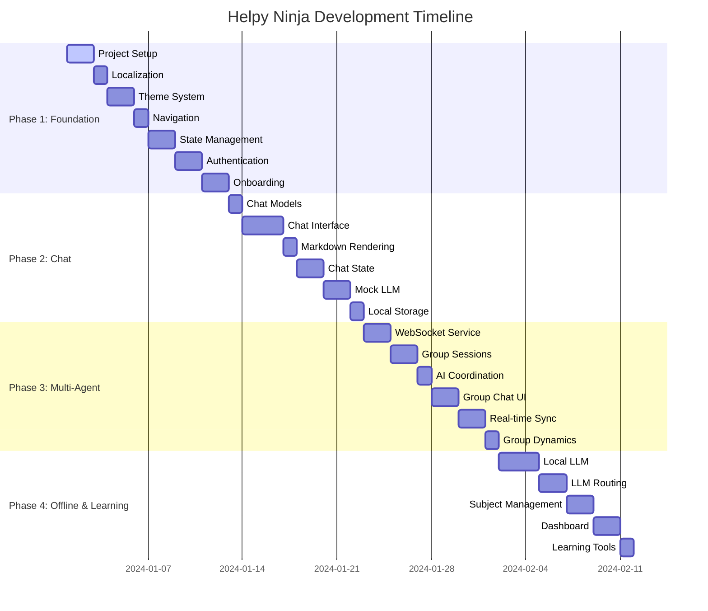

# Helpy Ninja - Project Summary & Quick Reference

## 📋 Documentation Overview

### Primary Documents
1. **[FRONTEND_IMPLEMENTATION_SPEC.md](./FRONTEND_IMPLEMENTATION_SPEC.md)** - Complete technical specification (guiding light)
2. **[DEVELOPMENT_ROADMAP.md](./DEVELOPMENT_ROADMAP.md)** - Detailed task breakdown and procedures (roadmap to follow)
3. **[helpy_ninja_spec.md](./helpy_ninja_spec.md)** - Original platform specification
4. **[helpy_ninja_frontend.md](./helpy_ninja_frontend.md)** - Original frontend documentation

## 🎯 Key Decisions Made

### State Management: Riverpod 2.0 ✅
**Why Riverpod over BLoC:**
- ✅ **Compile-time safety** - No runtime DI errors
- ✅ **Less boilerplate** - More concise for chat & AI features  
- ✅ **Better testability** - Easy mocking and overrides
- ✅ **Family providers** - Perfect for conversation/subject parameters
- ✅ **Auto-dispose** - Automatic memory management
- ✅ **Reactive by default** - Ideal for real-time multi-agent chat

### Localization: Vietnamese + English ✅
- **Primary Markets**: Vietnam (initial) + USA (expansion)
- **Implementation**: ARB files with intl_utils generator
- **Fallback**: English as default for missing translations
- **Font Support**: Google Fonts with Vietnamese diacritics

### UI/UX Design: Modern Tech-Conscious Youth ✅
- **Dark Mode First** - Primary theme for tech users
- **Glassmorphism** - Modern frosted glass effects
- **Micro-interactions** - 200-300ms smooth animations
- **Gesture-Rich** - Swipe to reply, pull to refresh
- **High Contrast** - WCAG AA compliant accessibility

## 📅 Development Timeline (8 Weeks)



## 🏗️ Architecture Overview

### Core Technology Stack
```
┌─ Presentation Layer ─────────────────────────┐
│  Flutter 3.x + Material 3                   │
│  Riverpod 2.0 (State Management)            │
│  Go Router (Navigation)                     │
│  Google Fonts + Custom Themes               │
└──────────────────────────────────────────────┘
┌─ Domain Layer ───────────────────────────────┐
│  Clean Architecture Entities                │
│  Use Cases & Repository Interfaces          │
└──────────────────────────────────────────────┘
┌─ Data Layer ─────────────────────────────────┐
│  Repository Implementations                 │
│  Remote: Dio + WebSocket                   │
│  Local: Hive + SharedPreferences          │
│  ML: TensorFlow Lite (Phi-3, Llama 3.2)   │
└──────────────────────────────────────────────┘
```

### Key Features Implementation
- **Multi-Agent Chat**: Multiple AI tutors coordinate in group sessions
- **Offline-First**: Local LLM models with intelligent cloud routing
- **Real-time Sync**: WebSocket-based group communication
- **Modern UI**: Dark-first theme with glassmorphism effects
- **Localization**: Full Vietnamese + English support

## 🔄 Development Process

### Quality Gates (Before Next Phase)
1. ✅ All unit tests pass (>80% coverage)
2. ✅ Widget tests pass for UI components  
3. ✅ `flutter analyze` reports no issues
4. ✅ Manual testing on 2+ devices
5. ✅ Documentation updated
6. ✅ Performance benchmarks met

### Pause & Test Points
- **Daily**: Run analyze + tests, check coverage
- **Weekly**: Demo to stakeholders, performance review
- **Phase End**: Full integration testing, stakeholder approval
- **Before Merge**: Code review, accessibility audit

### Emergency Procedures
- **Critical Bug**: 1hr hotfix branch, 4hr fix, 8hr deploy
- **Performance Issue**: Profile → optimize → verify → update baselines
- **Dependency Issue**: Research → test → update → verify

## 📱 Target Deliverables by Phase

### Phase 1: Foundation (Weeks 1-2)
- ✅ Complete project setup with localization
- ✅ Authentication flow with modern UI
- ✅ Onboarding experience with animations
- ✅ Theme system with dark/light modes

### Phase 2: Basic Chat (Weeks 3-4)  
- ✅ 1-on-1 chat with AI tutor
- ✅ Modern message bubbles with glassmorphism
- ✅ Markdown + LaTeX math rendering
- ✅ Offline message queuing

### Phase 3: Multi-Agent (Weeks 5-6)
- ✅ Group chat with multiple AI tutors
- ✅ Real-time coordination between AIs
- ✅ WebSocket-based synchronization
- ✅ Participant management UI

### Phase 4: Offline & Learning (Weeks 7-8)
- ✅ Local LLM with intelligent routing
- ✅ Subject management and progress tracking
- ✅ Modern dashboard with analytics
- ✅ Interactive learning tools

## 🧪 Testing Strategy

### Unit Testing
- Models serialization/deserialization
- Provider logic and state management
- Business logic and use cases
- Utility functions and helpers

### Widget Testing  
- Individual component behavior
- Screen layout and interactions
- Navigation flows
- Theme and localization

### Integration Testing
- Full user flows (auth → chat → group)
- API integration and error handling
- WebSocket communication
- Offline/online transitions

### Performance Testing
- Memory usage and leak detection
- Scroll performance in chat
- LLM inference speed
- Battery consumption

## 🚀 Getting Started

### Prerequisites
```bash
# Flutter SDK 3.x
flutter --version

# Development tools
dart pub global activate flutterfire_cli
dart pub global activate mason_cli
```

### Quick Start
```bash
# 1. Clone and setup
git clone <repository>
cd helpy_ninja

# 2. Install dependencies  
flutter pub get
dart run build_runner build

# 3. Generate localization
flutter packages pub run intl_utils:generate

# 4. Run app
flutter run --debug
```

### First Development Task
Start with **Task 1.1: Project Initialization & Dependencies** from the Development Roadmap.

## 📞 Support & Resources

### Documentation Links
- [Flutter Documentation](https://docs.flutter.dev/)
- [Riverpod Documentation](https://riverpod.dev/)
- [Go Router Documentation](https://pub.dev/packages/go_router)
- [Internationalization Guide](https://docs.flutter.dev/development/accessibility-and-localization/internationalization)

### Project-Specific Help
- **Architecture Questions**: Refer to FRONTEND_IMPLEMENTATION_SPEC.md
- **Task Details**: Check DEVELOPMENT_ROADMAP.md  
- **Design Guidelines**: See UI/UX section in specification
- **State Management**: Review Riverpod patterns in spec

---

**Ready to build the future of AI-powered education! 🥷📚✨**